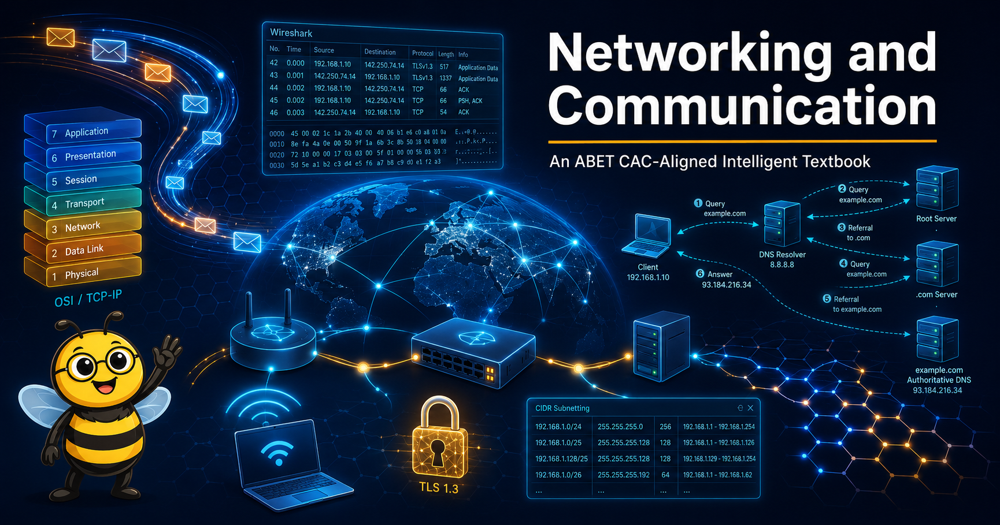

# Networking and Communication

<figure markdown>
  { width="100%" }
</figure>

Welcome to **Networking and Communication**, an ABET CAC-aligned intelligent textbook for undergraduate Computer Science and IT students.

## About This Book

Modern computing is networked computing. From the moment you open a laptop or unlock a phone, dozens of protocols negotiate addresses, route packets, secure connections, and deliver data across continents in milliseconds. This course makes the invisible visible — building a working mental model of how networks are designed, how data moves between hosts, and why the layered architecture that emerged in the 1970s still governs the systems we deploy today.

Topic depth and sequencing follow the **ACM/IEEE-CS CS2023 Networking and Communication (NC) knowledge area**, ensuring alignment with the most current authoritative standard. The pedagogical approach emphasizes hands-on labs, packet-level inspection, socket programming, and short capstone-style design exercises.

## Who This Book Is For

- Sophomore and junior undergraduates in Computer Science, Information Technology, Information Systems, Cybersecurity, or Computer Engineering
- Students in programs seeking ABET Computing Accreditation Commission (CAC) accreditation
- Practitioners who want a rigorous, structured reference grounded in current standards

**Prerequisites:** An introductory programming course (any language), discrete mathematics or basic graph theory, and familiarity with the command line.

## What You Will Learn

This book covers the full networking stack — from bits on a wire to application-layer protocols and programmable networks:

- **Layered Architecture** — OSI and TCP/IP models, encapsulation, end-to-end principle
- **Physical and Link Layers** — signaling, encoding, error detection, Ethernet, Wi-Fi
- **The Network Layer** — IPv4, IPv6, CIDR, NAT, routing algorithms (RIP, OSPF, BGP)
- **Transport Layer** — TCP connection management, flow and congestion control, UDP, QUIC
- **Application Protocols** — DNS, HTTP/1–3, TLS, SMTP, SSH, WebSockets
- **Network Security** — cryptography in transit, certificates, common attacks, defense in depth
- **Wireless and Mobility** — 4G/5G, Wi-Fi roaming, link adaptation
- **Network Programming** — Berkeley sockets API, client-server design, wire protocols
- **Software-Defined Networking** — control/data plane separation, OpenFlow, overlay networks

## How to Use This Book

Navigate using the sidebar to explore:

- **[Chapters](chapters/index.md)** — 16 structured chapters from introduction through SDN and capstone projects
- **[MicroSims](sims/index.md)** — interactive simulations for hands-on exploration of key concepts
- **[Learning Graph](learning-graph/index.md)** — interactive visualization of all 200 course concepts and their dependencies
- **[Glossary](glossary.md)** — definitions for all key networking terms
- **[FAQ](faq.md)** — answers to common student questions

## Getting Started

Begin with [Chapter 1: Introduction to Networks](chapters/01-intro-to-networks/index.md) to build the foundational mental model, then follow chapters in order — each one builds on the concepts established before it.

!!! mascot-welcome "Let's Trace the Route!"
    
    Hi, I'm Buzz! I'll be your guide through every layer of the network stack. Whether you're tracing a packet across the globe or debugging a three-way handshake, I'll be here to walk you through it — one hop at a time.
